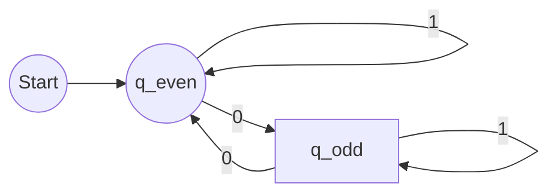
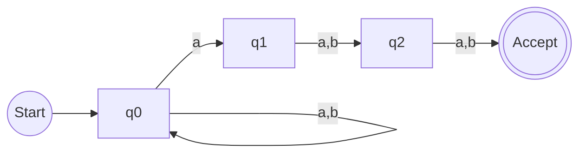
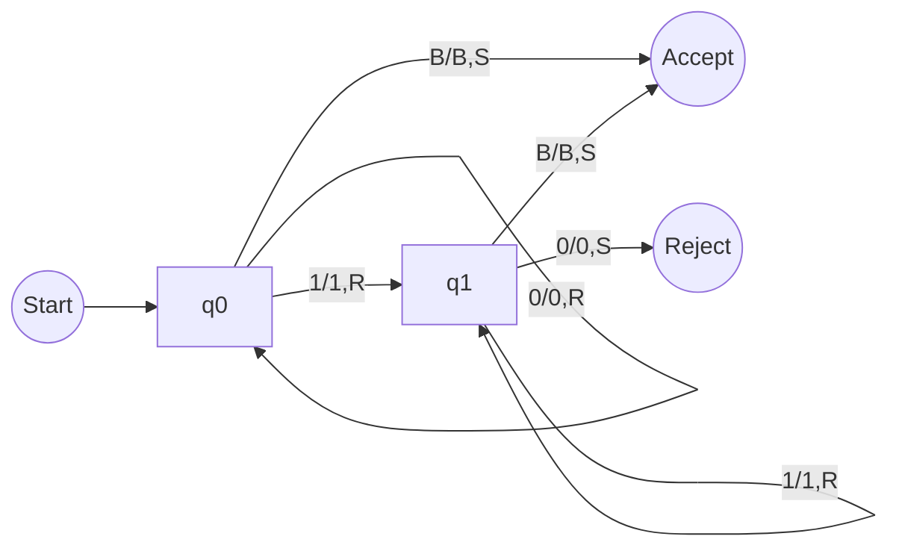
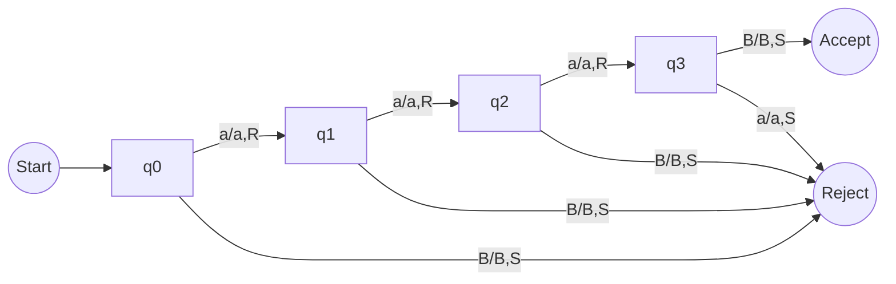

---
title_en: CS144 Lab 9: Computability Logic
title_zh: CS144 Lab 9: 图灵机与自动机逻辑
date: 2025-12-11
categories: CS144
tags: Turing Machine, DFA, NFA, Regex, Number Theory
summary_en: A comprehensive guide to Lab 9, covering Turing Machine design (0*1*, length 3), Finite Automata construction, Regex patterns, and Number Theory conversions. Includes logic flows and diagrams.
summary_zh: Lab 9 满分攻略。涵盖图灵机设计 (0*1*, 长度3)、有限自动机 (DFA/NFA) 构建、正则表达式解析及数论转换。内含 Mermaid 逻辑图与详细状态转移表。
---

[EN]

# 1. Strategy & Overview
This lab covers four distinct areas: **Turing Machines**, **Finite Automata**, **Regex**, and **Number Theory**.
According to the grading rules, only one question per section will be graded, but completion of all is required.
**Our Strategy:** Ensure **Absolute Perfection** on at least one question per section, while completing the rest with "Best Effort".

* **Tools**: Use [JSFLAP](https://elijahcirioli.com/jsflap/) for TM/FSM design.
* **Submission**: Paste screenshots into your final Word doc.

---

# 2. Part I: Turing Machines (TM)

### Core Concept
A Turing Machine is the theoretical limit of computation. It consists of:
1.  **Infinite Tape**: Memory cells.
2.  **Head**: Read/Write/Move (L/R).
3.  **State Register**: Current status.
4.  **Transition Function**: `(Current State, Read) -> (Next State, Write, Move)`.

### Q1.1: Language `0*1*`
**Logic**: Accept any number of '0's followed by any number of '1's.
* `q0`: Skips 0s. If it sees 1, moves to `q1`.
* `q1`: Skips 1s. If it sees 0, **Reject**.
* **Edge Case**: Empty string (B) is accepted.

```mermaid
graph LR
    start((Start)) --> q0
    q0 -- 0/0,R --> q0
    q0 -- 1/1,R --> q1
    q0 -- B/B,S --> accept((Accept))
    
    q1 -- 1/1,R --> q1
    q1 -- 0/0,S --> reject((Reject))
    q1 -- B/B,S --> accept
````

**Note:** The logic above simplifies the state transition for visual clarity. Ensure your JSFLAP implementation handles the specific "start with 1" vs "start with 0" transitions if required by strict definition, though `0*` implies 0 is optional.

### Q1.2: Exact Length 3 ("aaa")

**Logic**: Strict step-by-step verification.

1.  **q0**: Expect 'a' -\> go to q1.
2.  **q1**: Expect 'a' -\> go to q2.
3.  **q2**: Expect 'a' -\> go to q3.
4.  **q3**: Expect **Blank** (End of String) -\> **Accept**.

<!-- end list -->

  * Any deviation (seeing 'B' too early or 'a' too late) leads to **Reject**.

<!-- end list -->

```mermaid
graph LR
    start((Start)) --> q0
    q0 -- a/a,R --> q1
    q0 -- B/B,S --> reject((Reject))
    
    q1 -- a/a,R --> q2
    q1 -- B/B,S --> reject

    q2 -- a/a,R --> q3
    q2 -- B/B,S --> reject

    q3 -- B/B,S --> accept((Accept))
    q3 -- a/a,S --> reject
```

-----

# 3\. Part II: Finite Automata

### Q2.1: DFA for Even Number of 0s

**Logic**: We only need two states to track parity (Even vs Odd).

  * **q\_even**: Start state (0 is even). Accept state.
  * **q\_odd**: Non-accept state.
  * Input `0`: Flips state.
  * Input `1`: Maintains state.

<!-- end list -->



### Q2.2: NFA for "3rd char from end is 'a'"

**Logic**: NFA allows us to "guess".

  * **q0**: Loop on anything. Nondeterministically jump to `q1` if we see 'a'.
  * **q1**: We guessed this 'a' is the 3rd last. Now we need exactly 2 more chars.
  * **q2**: One more char needed.
  * **q3**: Accept.

<!-- end list -->



-----

# 4\. Part III: Regex & Number Theory

### Regex Logic

  * **Q3.1 `a(b|c)d`**: Starts with 'a', middle is 'b' OR 'c', ends with 'd'. (e.g., `abd`, `acd`).
  * **Q3.2 `a*b+c`**: Any 'a's, at least one 'b', exactly one 'c'. (e.g., `bc`, `abc`, `aaabbc`).
  * **Q3.3 Start 'a', End 'b'**:
      * Pattern: `a (anything)* b`
      * Regex: `a(a|b)*b`

### Number Theory Conversions

  * **Q4.1 Binary to Decimal**: `1011` -\> $8 + 0 + 2 + 1 = 11$
  * **Q4.2 Hex to Decimal**: `1A3` -\> $1(256) + 10(16) + 3(1) = 419$
  * **Q4.3 Decimal to Binary**: `45` -\> `32 + 8 + 4 + 1` -\> `101101`

[END]

[ZH]

# 1\. 概述与战略

本 Lab 9 包含四个核心部分：**图灵机**、**有限自动机**、**正则表达式**和**数论**。
评分规则极其明确：每部分只批改一题，但必须全部完成。
**战略**：确保每部分至少有一道题是**完美解答** (Perfect Solution)，其余题目尽力而为。

  * **工具**：强烈建议使用网页版 [JSFLAP](https://elijahcirioli.com/jsflap/) 进行设计并截图。
  * **提交**：将设计截图和文本答案整合到 Word 文档中。

-----

# 2\. 第一部分：图灵机 (Turing Machines)

### 核心原理

图灵机是计算能力的理论极限。它由以下部分组成：

1.  **无限纸带**: 存储单元。
2.  **读写头**: 读取、写入、左右移动 (L/R)。
3.  **状态寄存器**: 当前机器状态。
4.  **指令表**: `(当前状态, 读入) → (下一状态, 写入, 移动)`。

### Q1.1: 识别语言 `0*1*`

**逻辑**：接受任意数量的 '0'，后接任意数量的 '1'。

  * `q0`: 初始状态。处理 '0' 序列。遇到 '1' 跳转 `q1`。
  * `q1`: 处理 '1' 序列。如果此时再遇到 '0'，则是非法顺序，**拒绝**。
  * **边界**：空串 (B) 直接接受。

<!-- end list -->



### Q1.2: 长度恰好为 3 ("aaa")

**逻辑**：严格的步进验证。

1.  **q0**: 期待第一个 'a' -\> 进 q1。
2.  **q1**: 期待第二个 'a' -\> 进 q2。
3.  **q2**: 期待第三个 'a' -\> 进 q3。
4.  **q3**: 期待 **空白(B)** -\> **接受**。

<!-- end list -->

  * 任何步骤如果不符合（例如在 q3 遇到了第四个 'a'，或者在 q1 就遇到了空白），直接**拒绝**。

<!-- end list -->




*(注：请在 JSFLAP 中绘制以上逻辑，并将截图保存为 `images/Q1.2_TM_aaa.png` 放入 GitHub 仓库)*

-----

# 3\. 第二部分：有限自动机 (Finite Automata)

### Q2.1: DFA - 偶数个 0

**逻辑**：只需要两个状态来记录奇偶性。

  * **q\_even**: 初始状态（0个是偶数），也是接受状态。
  * **q\_odd**: 非接受状态。
  * 输入 `0`: 状态翻转。
  * 输入 `1`: 状态不变。

<!-- end list -->


### Q2.2: NFA - 倒数第三个字符是 'a'

**逻辑**：利用 NFA 的非确定性（猜测能力）。

  * **q0**: 循环吞掉任意字符。当遇到 'a' 时，分裂出一个分身进入 `q1`（猜测这是倒数第三个）。
  * **q1**: 此时必须再读任意 2 个字符才能结束。读第1个 -\> `q2`。
  * **q2**: 读第2个 -\> `q3`。
  * **q3**: 接受状态。

<!-- end list -->


-----

# 4\. 第三部分：正则与数论

### 正则表达式逻辑

  * **Q3.1 `a(b|c)d`**:
      * 以 'a' 开头，中间是 'b' 或 'c'，以 'd' 结尾。
      * 例: `abd`, `acd`。
  * **Q3.2 `a*b+c`**:
      * 任意个 'a' (0个或多个)，**至少一个** 'b'，正好一个 'c'。
      * 例: `bc`, `abc`, `aaabbc`。
  * **Q3.3 以 'a' 开头，以 'b' 结尾**:
      * 逻辑: `a` + `中间任意` + `b`
      * 正则: `a(a|b)*b`

### 数论转换 (速查)

  * **Q4.1 二进制转十进制**: `1011`
      * 计算: $1\times2^3 + 0 + 1\times2^1 + 1\times2^0 = 8 + 2 + 1 = 11$
  * **Q4.2 十六进制转十进制**: `1A3`
      * 计算: $1\times16^2 + 10\times16^1 + 3\times16^0 = 256 + 160 + 3 = 419$
  * **Q4.3 十进制转二进制**: `45`
      * 凑数法: $32 + 8 + 4 + 1$
      * 二进制: `101101`

[END]
