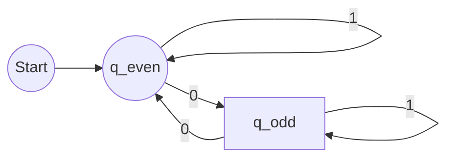
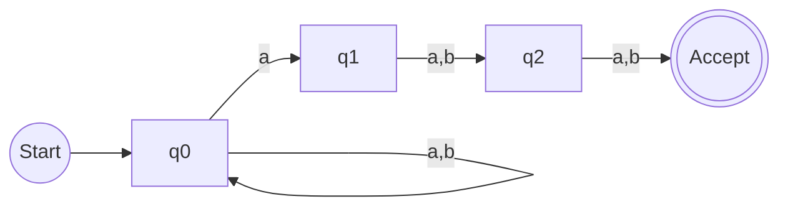

[EN]


# 1. Strategy & Overview
This lab covers four distinct areas: **Turing Machines**, **Finite Automata**, **Regex**, and **Number Theory**.
According to the grading rules, only one question per section will be graded, but completion of all is required.
**Our Strategy:** Ensure **Absolute Perfection** on at least one question per section, while completing the rest with "Best Effort".

* **Tools**: Use [JSFLAP](https://elijahcirioli.com/jsflap/) for TM/FSM design.
* **Submission**: Paste screenshots into your final Word doc.

---

# 2. Part I: Turing Machines (TM)

### Core Concept
A Turing Machine is the theoretical limit of computation. It consists of:
1.  **Infinite Tape**: Memory cells.
2.  **Head**: Read/Write/Move (L/R).
3.  **State Register**: Current status.
4.  **Transition Function**: `(Current State, Read) -> (Next State, Write, Move)`.

### Q1.1: Language `0*1*`
**Logic**: Accept any number of '0's followed by any number of '1's.
* `q0`: Skips 0s. If it sees 1, moves to `q1`.
* `q1`: Skips 1s. If it sees 0, **Reject**.
* **Edge Case**: Empty string (B) is accepted.

```mermaid
graph LR
    start((Start)) --> q0
    q0 -- "0/0,R" --> q0
    q0 -- "1/1,R" --> q1
    q0 -- "B/B,S" --> accept((Accept))
    
    q1 -- "1/1,R" --> q1
    q1 -- "0/0,S" --> reject((Reject))
    q1 -- "B/B,S" --> accept
````

**Note:** The logic above simplifies the state transition for visual clarity. Ensure your JSFLAP implementation handles the specific "start with 1" vs "start with 0" transitions if required by strict definition, though `0*` implies 0 is optional.

### Q1.2: Exact Length 3 ("aaa")

**Logic**: Strict step-by-step verification.

1.  **q0**: Expect 'a' -> go to q1.
2.  **q1**: Expect 'a' -> go to q2.
3.  **q2**: Expect 'a' -> go to q3.
4.  **q3**: Expect **Blank** (End of String) -> **Accept**.
* Any deviation (seeing 'B' too early or 'a' too late) leads to **Reject**.

```mermaid
graph LR
    start((Start)) --> q0
    q0 -- "a/a,R" --> q1
    q0 -- "B/B,S" --> reject((Reject))
    
    q1 -- "a/a,R" --> q2
    q1 -- "B/B,S" --> reject

    q2 -- "a/a,R" --> q3
    q2 -- "B/B,S" --> reject

    q3 -- "B/B,S" --> accept((Accept))
    q3 -- "a/a,S" --> reject
```

---

# 3. Part II: Finite Automata

### Q2.1: DFA for Even Number of 0s

**Logic**: We only need two states to track parity (Even vs Odd).
* **q_even**: Start state (0 is even). Accept state.
* **q_odd**: Non-accept state.
* Input `0`: Flips state.
* Input `1`: Maintains state.



### Q2.2: NFA for "3rd char from end is 'a'"

**Logic**: NFA allows us to "guess".
* **q0**: Loop on anything. Nondeterministically jump to `q1` if we see 'a'.
* **q1**: We guessed this 'a' is the 3rd last. Now we need exactly 2 more chars.
* **q2**: One more char needed.
* **q3**: Accept.



---

# 4. Part III: Regex & Number Theory

### Regex Logic

* **Q3.1 `a(b|c)d`**: Starts with 'a', middle is 'b' OR 'c', ends with 'd'. (e.g., `abd`, `acd`).
* **Q3.2 `a*b+c`**: Any 'a's, at least one 'b', exactly one 'c'. (e.g., `bc`, `abc`, `aaabbc`).
* **Q3.3 Start 'a', End 'b'**:
    * Pattern: `a (anything)* b`
    * Regex: `a(a|b)*b`

### Number Theory Conversions

* **Q4.1 Binary to Decimal**: `1011` -> $8 + 0 + 2 + 1 = 11$
* **Q4.2 Hex to Decimal**: `1A3` -> $1(256) + 10(16) + 3(1) = 419$
* **Q4.3 Decimal to Binary**: `45` -> `32 + 8 + 4 + 1` -> `101101`
[END]

[ZH]


# 1. 策略与总览
本次实验涵盖四个不同领域：**图灵机 (Turing Machines)**、**有限自动机 (Finite Automata)**、**正则表达式 (Regex)** 和 **数论 (Number Theory)**。
根据评分规则，每个部分只会对一道题进行评分，但要求完成所有题目。
**我们的策略是：** 确保每个部分至少有一道题做到 **绝对完美**，其余题目则尽力完成。

*   **工具**：使用 [JSFLAP](https://elijahcirioli.com/jsflap/) 进行图灵机 (TM) 和有限状态机 (FSM) 的设计。
*   **提交**：将设计好的截图粘贴到最终的 Word 文档中。

---

# 2. 第一部分：图灵机 (TM)

### 核心概念
图灵机是计算的理论模型极限。它由以下几个部分组成：
1.  **无限纸带**：作为存储单元。
2.  **读写头**：可以读取、写入和移动 (左/右)。
3.  **状态寄存器**：记录当前状态。
4.  **转移函数**：`(当前状态, 读取符号) -> (下一状态, 写入符号, 移动方向)`。

### 问题 1.1：识别语言 `0*1*`
**逻辑**：接受任意数量的 '0' 后面跟着任意数量的 '1' 的字符串。
* `q0`：起始状态，跳过所有的 '0'。如果遇到 '1'，则转移到 `q1`。
* `q1`：跳过所有的 '1'。如果在此状态遇到 '0'，则 **拒绝**。
* **边界情况**：空字符串 (B) 应被接受。

```mermaid
graph LR
    start((Start)) --> q0
    q0 -- "0/0,R" --> q0
    q0 -- "1/1,R" --> q1
    q0 -- "B/B,S" --> accept((Accept))
    
    q1 -- "1/1,R" --> q1
    q1 -- "0/0,S" --> reject((Reject))
    q1 -- "B/B,S" --> accept
````

**注意**：为了视觉上的清晰，上图简化了状态转移。请确保您在 JSFLAP 中的实现能够处理严格定义下“以 1 开头”与“以 0 开头”的转移细节，尽管 `0*` 暗示了 '0' 是可选的。

### 问题 1.2：识别精确长度为 3 的字符串 ("aaa")
**逻辑**：进行严格的逐字符验证。
1.  **q0**：期望读到 'a'，然后转移到 q1。
2.  **q1**：期望读到 'a'，然后转移到 q2。
3.  **q2**：期望读到 'a'，然后转移到 q3。
4.  **q3**：期望读到 **空白符** (字符串结束)，则 **接受**。
*   任何偏离预期的输入 (例如过早遇到空白符 'B' 或过晚遇到 'a') 都将导致 **拒绝**。

```mermaid
graph LR
    start((Start)) --> q0
    q0 -- "a/a,R" --> q1
    q0 -- "B/B,S" --> reject((Reject))
    
    q1 -- "a/a,R" --> q2
    q1 -- "B/B,S" --> reject

    q2 -- "a/a,R" --> q3
    q2 -- "B/B,S" --> reject

    q3 -- "B/B,S" --> accept((Accept))
    q3 -- "a/a,S" --> reject
```

---

# 3. 第二部分：有限自动机

### 问题 2.1：用于识别偶数个 '0' 的 DFA
**逻辑**：我们仅需两个状态来追踪 '0' 数量的奇偶性。
* **q_even**：起始状态 (0 个 '0' 是偶数)，也是接受状态。
* **q_odd**：非接受状态。
* 输入 `0`：翻转状态 (从偶到奇，或从奇到偶)。
* 输入 `1`：保持当前状态不变。


### 问题 2.2：用于识别“倒数第三个字符是 'a'”的 NFA
**逻辑**：NFA (非确定性有限自动机) 允许我们进行“猜测”。
* **q0**：对任何输入 (`a` 或 `b`) 进行自循环。当读到 'a' 时，非确定性地跳转到 `q1` (猜测这个 'a' 可能就是倒数第三个)。
* **q1**：我们已经猜到了倒数第三个是 'a'。现在需要精确匹配后面两个字符。
* **q2**：还需要再匹配一个字符。
* **q3**：接受状态。


---

# 4. 第三部分：正则表达式与数论

### 正则表达式逻辑
* **问题 3.1 `a(b|c)d`**：以 'a' 开始，中间是 'b' 或 'c'，以 'd' 结束。(例如：`abd`, `acd`)。
* **问题 3.2 `a*b+c`**：任意数量的 'a' (包括零个)，至少一个 'b'，紧跟一个 'c'。(例如：`bc`, `abc`, `aaabbc`)。
* **问题 3.3 以 'a' 开始, 以 'b' 结束**：
    *   模式：`a` + (任意字符序列) + `b`
    *   正则表达式： `a(a|b)*b`

### 数论转换
* **问题 4.1 二进制转十进制**：`1011`₂ -> $1 \times 2^3 + 0 \times 2^2 + 1 \times 2^1 + 1 \times 2^0 = 8 + 0 + 2 + 1 = 11$₁₀
* **问题 4.2 十六进制转十进制**：`1A3`₁₆ -> $1 \times 16^2 + 10 \times 16^1 + 3 \times 16^0 = 256 + 160 + 3 = 419$₁₀
* **问题 4.3 十进制转二进制**：`45`₁₀ -> `32 + 8 + 4 + 1` -> $1 \times 2^5 + 0 \times 2^4 + 1 \times 2^3 + 1 \times 2^2 + 0 \times 2^1 + 1 \times 2^0$ -> `101101`₂
[END]
```