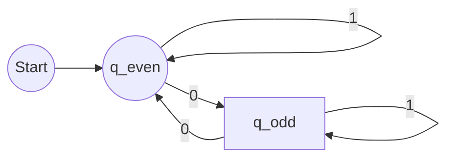
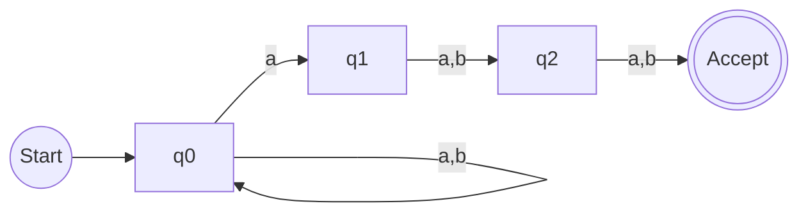

[EN]


# 1. Strategy & Overview
This lab covers four distinct areas: **Turing Machines**, **Finite Automata**, **Regex**, and **Number Theory**.
According to the grading rules, only one question per section will be graded, but completion of all is required.
**Our Strategy:** Ensure **Absolute Perfection** on at least one question per section, while completing the rest with "Best Effort".

* **Tools**: Use [JSFLAP](https://elijahcirioli.com/jsflap/) for TM/FSM design.
* **Submission**: Paste screenshots into your final Word doc.

---

# 2. Part I: Turing Machines (TM)

### Core Concept
A Turing Machine is the theoretical limit of computation. It consists of:
1.  **Infinite Tape**: Memory cells.
2.  **Head**: Read/Write/Move (L/R).
3.  **State Register**: Current status.
4.  **Transition Function**: `(Current State, Read) -> (Next State, Write, Move)`.

### Q1.1: Language `0*1*`
**Logic**: Accept any number of '0's followed by any number of '1's.
* `q0`: Skips 0s. If it sees 1, moves to `q1`.
* `q1`: Skips 1s. If it sees 0, **Reject**.
* **Edge Case**: Empty string (B) is accepted.

```mermaid
graph LR
    start((Start)) --> q0
    q0 -- "0/0,R" --> q0
    q0 -- "1/1,R" --> q1
    q0 -- "B/B,S" --> accept((Accept))
    
    q1 -- "1/1,R" --> q1
    q1 -- "0/0,S" --> reject((Reject))
    q1 -- "B/B,S" --> accept
````

**Note:** The logic above simplifies the state transition for visual clarity. Ensure your JSFLAP implementation handles the specific "start with 1" vs "start with 0" transitions if required by strict definition, though `0*` implies 0 is optional.

### Q1.2: Exact Length 3 ("aaa")

**Logic**: Strict step-by-step verification.

1.  **q0**: Expect 'a' -\> go to q1.
2.  **q1**: Expect 'a' -\> go to q2.
3.  **q2**: Expect 'a' -\> go to q3.
4.  **q3**: Expect **Blank** (End of String) -\> **Accept**.

<!-- end list -->

  * Any deviation (seeing 'B' too early or 'a' too late) leads to **Reject**.

<!-- end list -->

```mermaid
graph LR
    start((Start)) --> q0
    q0 -- "a/a,R" --> q1
    q0 -- "B/B,S" --> reject((Reject))
    
    q1 -- "a/a,R" --> q2
    q1 -- "B/B,S" --> reject

    q2 -- "a/a,R" --> q3
    q2 -- "B/B,S" --> reject

    q3 -- "B/B,S" --> accept((Accept))
    q3 -- "a/a,S" --> reject
```

-----

# 3\. Part II: Finite Automata

### Q2.1: DFA for Even Number of 0s

**Logic**: We only need two states to track parity (Even vs Odd).

  * **q\_even**: Start state (0 is even). Accept state.
  * **q\_odd**: Non-accept state.
  * Input `0`: Flips state.
  * Input `1`: Maintains state.

<!-- end list -->



### Q2.2: NFA for "3rd char from end is 'a'"

**Logic**: NFA allows us to "guess".

  * **q0**: Loop on anything. Nondeterministically jump to `q1` if we see 'a'.
  * **q1**: We guessed this 'a' is the 3rd last. Now we need exactly 2 more chars.
  * **q2**: One more char needed.
  * **q3**: Accept.

<!-- end list -->



-----

# 4\. Part III: Regex & Number Theory

### Regex Logic

  * **Q3.1 `a(b|c)d`**: Starts with 'a', middle is 'b' OR 'c', ends with 'd'. (e.g., `abd`, `acd`).
  * **Q3.2 `a*b+c`**: Any 'a's, at least one 'b', exactly one 'c'. (e.g., `bc`, `abc`, `aaabbc`).
  * **Q3.3 Start 'a', End 'b'**:
      * Pattern: `a (anything)* b`
      * Regex: `a(a|b)*b`

### Number Theory Conversions

  * **Q4.1 Binary to Decimal**: `1011` -\> $8 + 0 + 2 + 1 = 11$
  * **Q4.2 Hex to Decimal**: `1A3` -\> $1(256) + 10(16) + 3(1) = 419$
  * **Q4.3 Decimal to Binary**: `45` -\> `32 + 8 + 4 + 1` -\> `101101`

[END]

[ZH]
还有必要吗？
[END]
