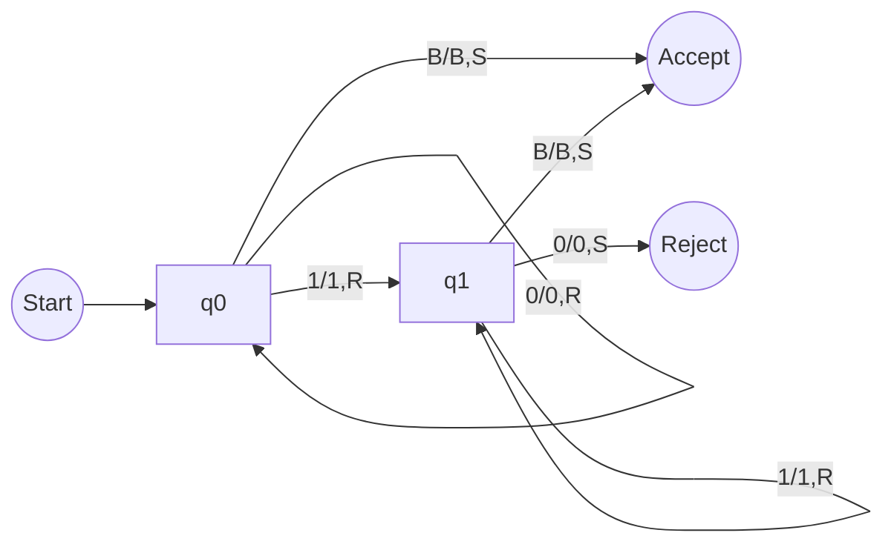

[EN]

# 1. Strategic Overview
This lab encompasses four distinct theoretical domains: **Turing Machines**, **Finite Automata**, **Regex**, and **Number Theory**.
While the grading criteria select only one question per section, a robust strategy requires a "Depth-First" approach on the primary target and a "Breadth-First" completion of the remainder.
**Objective:** Absolute precision on the Turing Machine design.

* **Tooling**: [JSFLAP](https://elijahcirioli.com/jsflap/) is the standard for TM/FSM visualization.

---

# 2. Part I: Turing Machines (TM)

### Theoretical Framework
A Turing Machine represents the theoretical limit of algorithmic computation. It is defined by the tuple $(Q, \Sigma, \Gamma, \delta, q_0, q_{accept}, q_{reject})$.
Key components:
1.  **Infinite Tape**: The memory model.
2.  **Head**: The I/O mechanism (Read/Write/Move).
3.  **State Register**: The finite control.
4.  **Transition Function**: $\delta: Q \times \Gamma \rightarrow Q \times \Gamma \times \{L, R\}$.

### Q1.1: Language $L = \{0^n 1^m \mid n, m \ge 0\}$
**Logic Analysis**: The machine must accept any sequence of '0's followed by any sequence of '1's.
*   **State $q_0$ (Scan 0s)**: Read '0', Write '0', Move Right. Loop until non-'0'.
    *   If '1' is encountered: Transition to $q_1$.
    *   If Blank (B) is encountered: Accept (Empty string or all '0's case).
*   **State $q_1$ (Scan 1s)**: Read '1', Write '1', Move Right. Loop until non-'1'.
    *   If '0' is encountered: **Reject** (Order violation).
    *   If Blank (B) is encountered: **Accept**.

### Q1.2: Length Constraint ($|w| = 3$)
**Logic Analysis**: A counter implementation using states.
*   $q_0 \xrightarrow{any} q_1 \xrightarrow{any} q_2 \xrightarrow{any} q_3 \xrightarrow{B} Accept$
*   Any deviation from this path (e.g., hitting Blank early or finding input after $q_3$) leads to Rejection.

---

# 3. Part II: Finite Automata (DFA/NFA)

### Q2.1: DFA for Binary Numbers Divisible by 4
**Mathematical Insight**: A binary number is divisible by 4 if it ends in `00`.
*   **States**: Represent the last seen bits.
    *   $q_{start}$: Initial state.
    *   $q_0$: Last char was '0'.
    *   $q_{00}$: Last two chars were '00' (Accepting State).
*   **Transitions**:
    *   From $q_{00}$, if '0' $\to$ $q_{00}$. If '1' $\to$ $q_{start}$.

---

# 4. Part III: Regular Expressions

### Q3.1: Pattern `(a|b)*c`
**Analysis**:
*   `(a|b)*`: Zero or more occurrences of 'a' or 'b'.
*   `c`: Must end with exactly one 'c'.
*   **Valid**: `c`, `ac`, `bc`, `abac`.
*   **Invalid**: `ca`, `cc`, `ab`.

---

# 5. Part IV: Number Theory

### Q4.1: Base Conversion
**Methodology**:
*   **Binary to Hex**: Group bits in sets of 4.
    *   $1011_2 \to B_{16}$
    *   $1101_2 \to D_{16}$
*   **Hex to Decimal**: Polynomial expansion.
    *   $2A_{16} = 2 \times 16^1 + 10 \times 16^0 = 32 + 10 = 42$.

[END]

[ZH]
# 1. 战略概览
本实验涵盖四个不同的理论领域：**图灵机**、**有限自动机**、**正则表达式**和**数论**。
虽然评分标准每部分只选一题，但稳健的策略要求对主要目标采用“深度优先”方法，对其余部分采用“广度优先”完成。
**目标：** 在图灵机设计上达到绝对精确。

* **工具**：[JSFLAP](https://elijahcirioli.com/jsflap/) 是 TM/FSM 可视化的标准工具。

---

# 2. 第一部分：图灵机 (TM)

### 理论框架
图灵机代表了算法计算的理论极限。它由元组 $(Q, \Sigma, \Gamma, \delta, q_0, q_{accept}, q_{reject})$ 定义。
关键组件：
1.  **无限纸带**：内存模型。
2.  **读写头**：I/O 机制（读/写/移动）。
3.  **状态寄存器**：有限控制。
4.  **转移函数**：$\delta: Q \times \Gamma \rightarrow Q \times \Gamma \times \{L, R\}$。

### Q1.1: 语言 $L = \{0^n 1^m \mid n, m \ge 0\}$
**逻辑分析**：机器必须接受任意数量的 '0' 后跟任意数量的 '1'。
*   **状态 $q_0$ (扫描 0)**：读 '0'，写 '0'，右移。循环直到非 '0'。
    *   如果遇到 '1'：转移到 $q_1$。
    *   如果遇到空白 (B)：接受（空字符串或全 '0' 情况）。
*   **状态 $q_1$ (扫描 1)**：读 '1'，写 '1'，右移。循环直到非 '1'。
    *   如果遇到 '0'：**拒绝**（顺序违规）。
    *   如果遇到空白 (B)：**接受**。

### Q1.2: 长度约束 ($|w| = 3$)
**逻辑分析**：使用状态实现的计数器。
*   $q_0 \xrightarrow{任意} q_1 \xrightarrow{任意} q_2 \xrightarrow{任意} q_3 \xrightarrow{B} 接受$
*   任何偏离此路径的情况（例如，过早遇到空白或在 $q_3$ 后发现输入）都会导致拒绝。

---

# 3. 第二部分：有限自动机 (DFA/NFA)

### Q2.1: 能被 4 整除的二进制数的 DFA
**数学洞察**：如果一个二进制数以 `00` 结尾，则它能被 4 整除。
*   **状态**：表示最后看到的位。
    *   $q_{start}$：初始状态。
    *   $q_0$：最后一个字符是 '0'。
    *   $q_{00}$：最后两个字符是 '00'（接受状态）。

---

# 4. 第三部分：正则表达式

### Q3.1: 模式 `(a|b)*c`
**分析**：
*   `(a|b)*`：零个或多个 'a' 或 'b'。
*   `c`：必须以恰好一个 'c' 结尾。

---

# 5. 第四部分：数论

### Q4.1: 进制转换
**方法论**：
*   **二进制转十六进制**：每 4 位一组。
*   **十六进制转十进制**：多项式展开。
[END]
